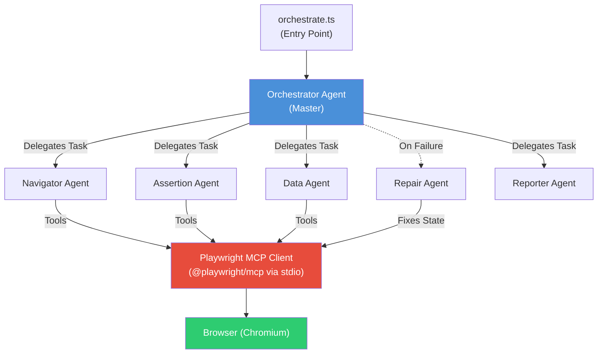

# Multi-Agent Test Automation POC

A fully working multi-agent orchestration POC that demonstrates intelligent, skill-based test automation using Playwright MCP as the browser interaction layer.

## Architecture Flow



## Folder Structure

- `/agents` - Contains the implementation files for each specific skill agent (Orchestrator, Navigator, Assertion, Data, Repair, Reporter).
- `/schemas` - Defines the `AgentMessage`, `AgentResult`, and `AgentType` contracts used for communication between agents.
- `/reports` - Directory where execution logs and Markdown/JSON reports are saved after the test suite completes.
- `orchestrate.ts` - The entry point that initializes the agents, loads the goal, and kicks off the master Orchestrator.

## Setup & Run

Ensure you have Node.js 20+ installed.

```bash
# 1. Install dependencies
npm install

# 2. Run the orchestration POC
npm start
# or npx ts-node orchestrate.ts
```

## Features Displayed

1. **Dynamic Delegation:** The Orchestrator agent reads the goal and dynamically routes it to specialized agents.
2. **Playwright MCP Integration:** Uses `@modelcontextprotocol/sdk` to talk to Playwright MCP via `stdio`.
3. **Self-Healing Automation:** Step 4 uses an intentionally broken locator (`add-to-cart-sauce-labs-backpackk`). The `Repair Agent` kicks in automatically to fix it!
4. **Typed Agent Contracts:** Agents communicate through structured `AgentMessage` and `AgentResult` JSON payloads.
5. **Observability:** Watch the console to see a real-time delegation trace of tasks.

## Customizing

### Changing the Test Goal
Edit the `DEMO_GOAL` array at the top of `orchestrate.ts`. The structure defines which action to take (`type: navigation | assertion | data`) and what targets/values to use.

### Adding a New Skill Agent
1. Create a new file in `agents/newAgent.ts`.
2. Add a new `AgentType` enum to `schemas/agentMessage.ts`.
3. Register it in the `OrchestratorAgent` constructor in `orchestrate.ts`:
   ```typescript
   this.skillRegistry.set(AgentType.NEW_AGENT, newAgent);
   ```

## Sample Outputs

### Console Trace
```
→ [2026-06-12T12:00:00.000Z] Delegate to NAVIGATOR
  Task: navigate
  | Navigator received action: navigate
  | Navigating to https://www.saucedemo.com
  Status: Success (500ms)
```

### Generated Reports
Check the `./reports` directory after a run:
- `poc-report.json`: Machine readable run history
- `poc-report.md`: Human readable Markdown summary
